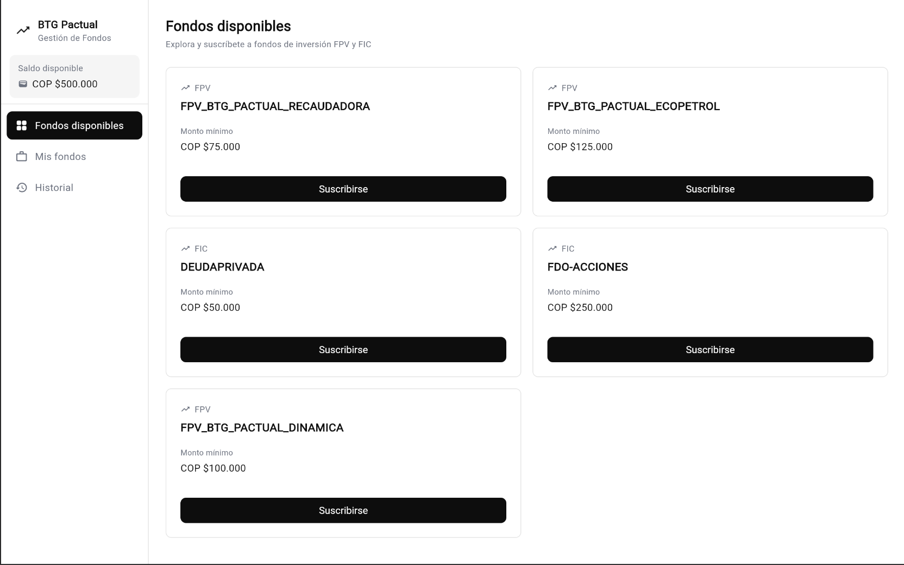
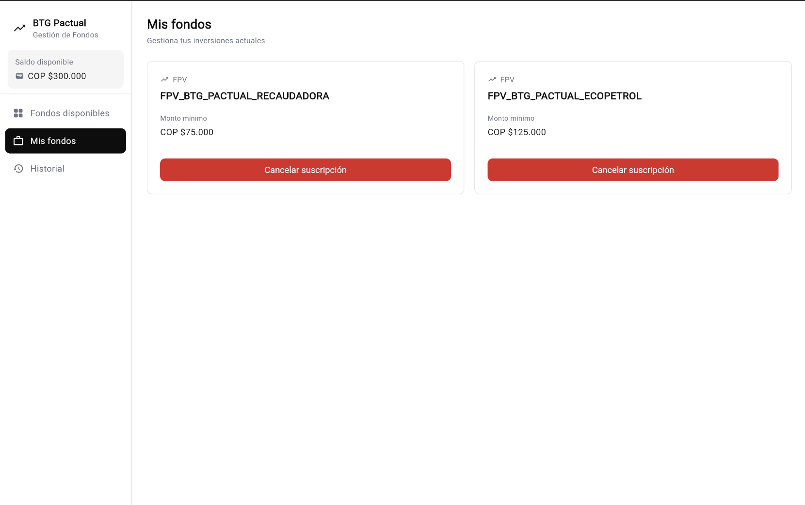
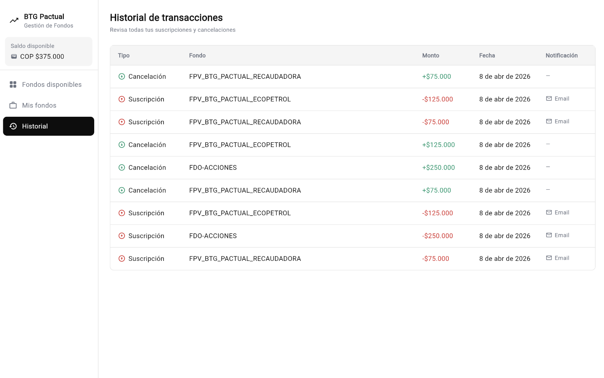
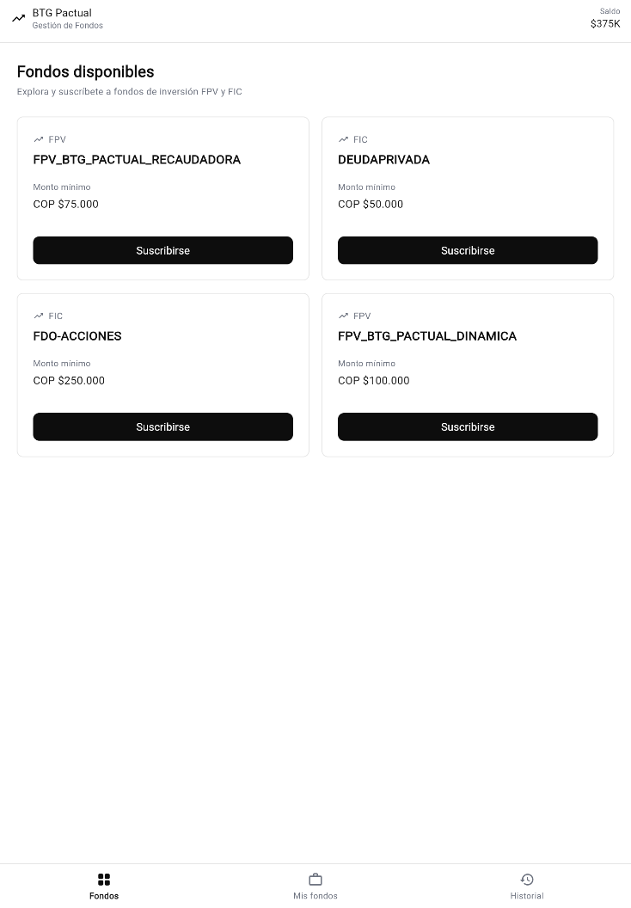
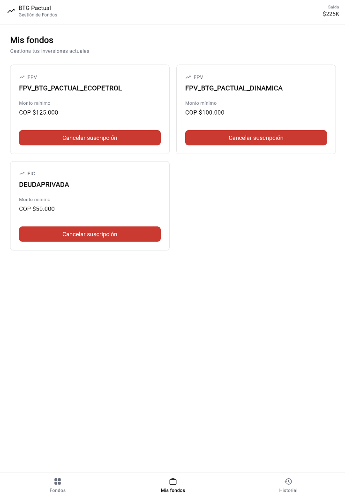
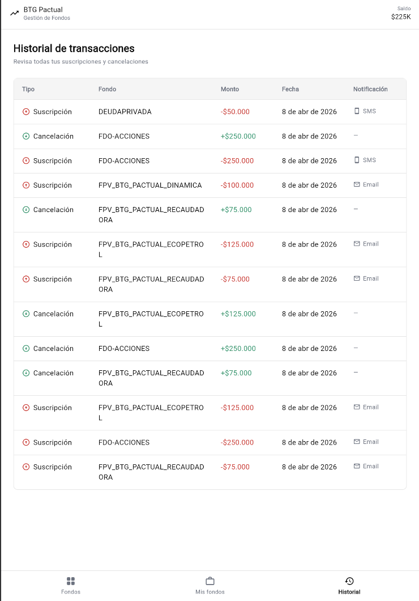
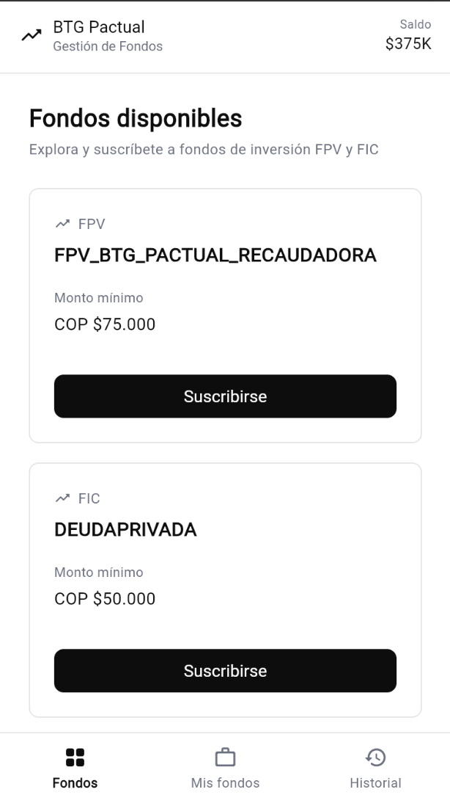
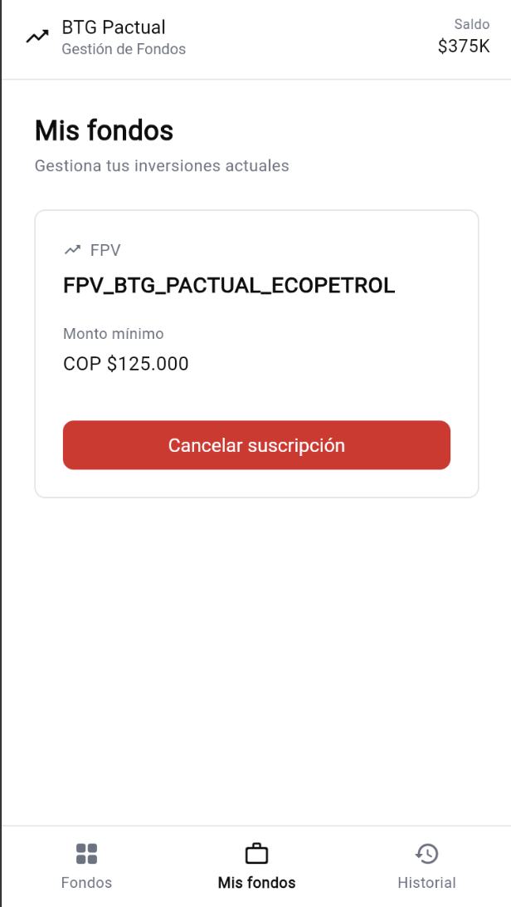
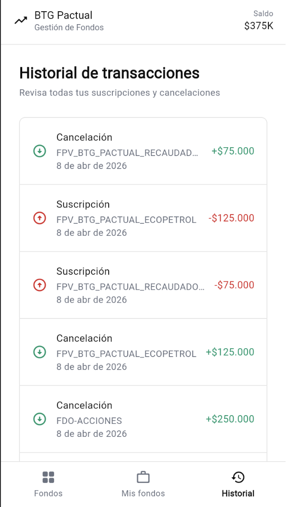

# Ceiba Fund Manager

Aplicación Flutter para gestión de fondos de inversión colombianos (FPV y FIC). Desarrollada con arquitectura limpia, BLoC para manejo de estado y diseño totalmente responsivo.

---

## Tabla de contenidos

- [Vista previa](#vista-previa)
- [Características](#características)
- [Arquitectura](#arquitectura)
- [Stack tecnológico](#stack-tecnológico)
- [Estructura del proyecto](#estructura-del-proyecto)
- [Requisitos previos](#requisitos-previos)
- [Instalación y ejecución](#instalación-y-ejecución)
- [Pruebas](#pruebas)
- [Decisiones de diseño](#decisiones-de-diseño)

---

## Vista previa

El diseño es **totalmente responsivo** y se adapta automáticamente a escritorio, tablet y móvil.

### Desktop (≥ 1024px)

| Fondos disponibles | Mis fondos | Historial |
|:---:|:---:|:---:|
|  |  |  |

---

### Tablet (600px – 1023px)

| Fondos disponibles | Mis fondos | Historial |
|:---:|:---:|:---:|
|  |  |  |

---

### Mobile (< 600px)

| Fondos disponibles | Mis fondos | Historial |
|:---:|:---:|:---:|
|  |  |  |

---

## Características

### Fondos disponibles
- Listado completo de fondos de inversión FPV y FIC disponibles
- Visualización del monto mínimo de apertura por fondo
- Suscripción a fondos con monto personalizado
- Validaciones: saldo insuficiente, monto mínimo no alcanzado, suscripción duplicada

### Mis fondos
- Visualización de todas las suscripciones activas del usuario
- Cancelación de suscripciones con reembolso automático del saldo invertido
- Detalle de cada suscripción: nombre, categoría, monto y fecha de vinculación

### Historial de transacciones
- Registro completo de suscripciones y cancelaciones
- Ordenado por fecha descendente (más reciente primero)
- Vista en tabla en escritorio / lista en móvil

### Gestión de saldo
- Saldo inicial: **COP 500.000**
- Descuento automático al suscribirse a un fondo
- Reembolso automático al cancelar una suscripción
- Saldo visible en tiempo real en el encabezado de la app

---

## Arquitectura

El proyecto implementa **Clean Architecture** con separación estricta de capas, organizado por features.

```
┌─────────────────────────────────────────────┐
│              Presentation Layer             │
│         BLoC · Pages · Widgets              │
├─────────────────────────────────────────────┤
│               Domain Layer                  │
│       Entities · Use Cases · Repository     │
│               (interfaces)                  │
├─────────────────────────────────────────────┤
│                Data Layer                   │
│     Repository Impl · Data Sources          │
└─────────────────────────────────────────────┘
```

### Flujo de datos

```
UI (Widget)
   │  dispara Event
   ▼
FundsBloc
   │  llama UseCase
   ▼
Use Case
   │  llama Repository (interfaz)
   ▼
Repository Implementation
   │  llama Data Source
   ▼
FundsLocalDataSource (datos en memoria)
   │  retorna Either<Failure, T>
   ▼
BLoC emite nuevo FundsState
   │
   ▼
UI se reconstruye con BlocBuilder
```

### Manejo de errores

Se utiliza el patrón **Either** (librería `dartz`) para un manejo de errores tipado y seguro:

```
Either<Failure, T>
 ├── Left(Failure)  → error controlado (validación, red, caché)
 └── Right(T)       → resultado exitoso
```

Jerarquía de fallos:

| Failure | Descripción |
|---|---|
| `ValidationFailure` | Saldo insuficiente, monto mínimo no alcanzado, suscripción duplicada |
| `ServerFailure` | Errores inesperados del servidor |
| `NetworkFailure` | Problemas de conectividad |
| `CacheFailure` | Errores de caché |

---

## Stack tecnológico

| Categoría | Paquete | Versión | Propósito |
|---|---|---|---|
| Framework | Flutter | SDK | UI multiplataforma |
| Estado | flutter_bloc | ^9.1.1 | Manejo de estado reactivo |
| Navegación | go_router | ^17.2.0 | Enrutamiento declarativo |
| Inyección de dependencias | get_it | ^9.2.1 | Service locator / DI |
| Programación funcional | dartz | ^0.10.1 | Tipo `Either` para errores |
| Igualdad de valores | equatable | ^2.0.8 | Comparación estructural de entidades |
| IDs únicos | uuid | ^4.5.3 | Generación de identificadores |
| Testing BLoC | bloc_test | ^10.0.0 | Helpers para tests del BLoC |
| Mocking | mocktail | ^1.0.4 | Mocks tipados para tests |

---

## Estructura del proyecto

```
lib/
├── core/                          # Elementos transversales a toda la app
│   ├── design/
│   │   ├── theme/                 # AppTheme, AppColors, AppTextStyles
│   │   └── breakpoints/           # Breakpoints para diseño responsivo
│   ├── di/                        # Configuración de inyección de dependencias
│   ├── error/                     # Excepciones y Failures tipados
│   ├── extensions/                # Extensiones de Dart (Color, Platform)
│   ├── functions/                 # Utilidades (formatDate, formatAmount)
│   └── service/                   # DialogService
│
├── features/
│   └── funds/
│       ├── data/
│       │   ├── data_sources/      # FundsLocalDataSourceImpl (datos en memoria)
│       │   └── repositories/      # FundsRepositoryImpl
│       │
│       ├── domain/
│       │   ├── entities/          # Fund, Subscription, Transaction
│       │   ├── repositories/      # FundsRepository (contrato / interfaz)
│       │   └── usecases/          # GetAllFunds, Subscribe, Cancel, GetSubscriptions,
│       │                          # GetTransactions, GetBalance
│       │
│       └── presentation/
│           ├── bloc/              # FundsBloc, FundsEvent, FundsState
│           ├── pages/             # FondosDisponiblesPage, MisFondosPage, HistorialPage
│           └── widgets/           # Componentes de UI reutilizables
│
└── routing/                       # Configuración de GoRouter con ShellRoute

test/
├── core/                          # Tests de utilidades del core
├── features/
│   └── funds/
│       ├── data/                  # Tests de datasource y repository
│       ├── domain/                # Tests de entidades y use cases
│       └── presentation/          # Tests del BLoC
└── helpers/                       # Mocks y fixtures compartidos entre tests
```

---

## Requisitos previos

Antes de ejecutar el proyecto asegúrate de tener instalado:

- **Flutter SDK** `>=3.0.0` — [Guía de instalación oficial](https://docs.flutter.dev/get-started/install)
- **Dart SDK** (incluido con Flutter)
- **Git**

Verifica que tu entorno esté correctamente configurado:

```bash
flutter doctor
```

Todos los ítems relevantes deben aparecer con check verde (✓).

---

## Instalación y ejecución

### 1. Clona el repositorio

```bash
git clone <url-del-repositorio>
cd ceiba_technical_test
```

### 2. Instala las dependencias

```bash
flutter pub get
```

### 3. Ejecuta la aplicación

#### Navegador web — recomendado para apreciar el diseño responsivo

```bash
flutter run -d chrome
```

Para ver los distintos breakpoints en Chrome, usa las **DevTools del navegador** (`F12`) y activa la vista de dispositivos responsivos.

#### Emulador Android

```bash
# Lista los dispositivos disponibles
flutter devices

# Ejecuta en el dispositivo deseado
flutter run -d <device-id>
```

#### Simulador iOS (solo macOS)

```bash
open -a Simulator
flutter run -d ios
```

#### Escritorio macOS

```bash
flutter run -d macos
```

### 4. Build de producción

```bash
# Web
flutter build web

# Android APK
flutter build apk --release

# iOS (solo macOS)
flutter build ios --release
```

---

## Pruebas

La suite de tests cubre todas las capas de la arquitectura con más de 30 casos de prueba.

### Ejecutar todos los tests

```bash
flutter test
```

### Ejecutar con reporte de cobertura

```bash
flutter test --coverage
```

### Ejecutar por capa

```bash
# Tests del BLoC (presentación)
flutter test test/features/funds/presentation/

# Tests del dominio (use cases y entidades)
flutter test test/features/funds/domain/

# Tests de datos (datasource y repository)
flutter test test/features/funds/data/

# Tests del core (utilidades)
flutter test test/core/
```

### Cobertura por capa

| Capa | Archivo principal | Qué se prueba |
|---|---|---|
| BLoC | `funds_bloc_test.dart` | Carga inicial, suscripción exitosa, cancelación, errores de validación, limpieza de errores |
| Repository | `funds_repository_impl_test.dart` | Mapeo de excepciones a Failures tipados |
| Data Source | `funds_local_datasource_test.dart` | CRUD completo, validación de saldo, monto mínimo, suscripción duplicada |
| Use Cases | `*_usecase_test.dart` | Flujos exitosos y de error por cada caso de uso |
| Entidades | `fund_test.dart`, `subscription_test.dart`, `transaction_test.dart` | Igualdad de valores, props de Equatable |
| Utilidades | `format_date_test.dart`, `format_amount_test.dart` | Formateo de fechas y montos en formato colombiano |

---

## Decisiones de diseño

### Clean Architecture
Permite que cada capa sea testeada de forma independiente y que la fuente de datos (actualmente en memoria) pueda reemplazarse por una API real sin modificar el dominio ni la presentación. La única pieza a cambiar sería el `DataSource`.

### BLoC como manejo de estado
Produce un flujo de datos unidireccional predecible, facilita el testing exhaustivo del comportamiento del estado y desacopla completamente la lógica de negocio de la UI.

### Diseño responsivo con breakpoints
La app detecta el ancho de pantalla y cambia el layout completo:
- **Desktop (≥ 1024px):** navegación lateral, historial en tabla, contenido expandido
- **Mobile/Tablet (< 1024px):** navegación inferior, historial en lista

### GetIt como service locator
Permite registrar implementaciones concretas contra interfaces y sustituirlas por mocks en tests sin modificar el código fuente de las capas superiores.

### Either para manejo de errores
En lugar de lanzar excepciones en el dominio, se utiliza `Either<Failure, T>` de `dartz`. Los errores son parte del contrato de cada función, lo que obliga al consumidor a manejarlos explícitamente y evita errores no controlados en runtime.

---

## Notas para el evaluador

- Los datos son **en memoria** y no persisten entre reinicios de la app. Esto es intencional para la prueba técnica; la arquitectura está lista para conectarse a un backend real.
- El saldo inicial es **COP 500.000** según los requisitos del enunciado.
- Los fondos disponibles y sus montos mínimos están definidos en `FundsLocalDataSourceImpl` conforme a los datos provistos en el enunciado de la prueba.
- Se recomienda ejecutar en Chrome y usar las DevTools para verificar el comportamiento responsivo en los tres breakpoints.
